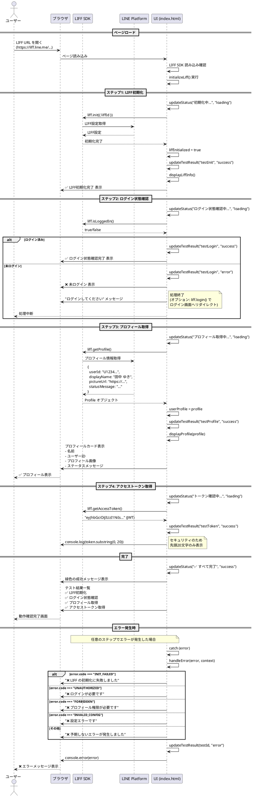

# LIFF 認証テスト処理フロー - シーケンス図

**作成日**: 2025-11-13
**関連**: [LIFF ユーザー認証調査](../research/liff-user-authentication.md)、[Phase 1 残作業リスト](./2025-11-12-phase1-remaining-tasks.md)
**実装**: `prototypes/mvp/liff-auth-test/index.html`

---

## 概要

`prototypes/mvp/liff-auth-test/index.html` で実装したLIFF SDK による認証フローの処理シーケンスを図示。

---

## シーケンス図（PlantUML）



---

## 参加者（Actors & Participants）

| 参加者 | 役割 |
|--------|------|
| **ユーザー** | LINEアプリでLIFF URLを開く人 |
| **ブラウザ** | LINEアプリ内のWebビュー（または外部ブラウザ） |
| **LIFF SDK** | LINE提供のJavaScriptライブラリ（`@line/liff`） |
| **LINE Platform** | LINEのサーバー（認証・プロフィール管理） |
| **UI (index.html)** | 今回実装したJavaScriptロジック |

---

## 処理フェーズの詳細

### フェーズ1: ページロード

```javascript
window.addEventListener('load', () => {
  if (typeof liff === 'undefined') {
    updateStatus('❌ LIFF SDK の読み込みに失敗しました', 'error');
    return;
  }
  initializeLiff();
});
```

**処理内容**:
1. ユーザーがLINE Keep メモやチャットからLIFF URLをタップ
2. ブラウザが `index.html` を読み込み
3. LIFF SDK（CDN: `https://static.line-scdn.net/liff/edge/2/sdk.js`）の読み込み確認
4. `initializeLiff()` 関数を実行

---

### フェーズ2: ステップ1 - LIFF初期化

```javascript
await liff.init({ liffId: LIFF_ID });
```

**処理内容**:
1. LIFF SDK が LINE Platform に接続
2. LIFF ID（`2008484018-nMrvLmk6`）に対応する設定を取得
3. 初期化完了後、以下を取得可能になる：
   - ログイン状態
   - LIFF Context（環境情報）
   - OS情報

**成功時**:
- `liffInitialized = true`
- ✅ アイコン表示
- LIFF情報セクション表示（LIFF ID、環境、OS）

**失敗時**:
- エラーコード: `INIT_FAILED`
- 処理中断

---

### フェーズ3: ステップ2 - ログイン状態確認

```javascript
if (!liff.isLoggedIn()) {
  updateTestResult('testLogin', 'error');
  updateStatus('未ログインです。ログインしてください。', 'info');
  // liff.login(); // 自動ログイン（オプション）
  return;
}
```

**処理内容**:
1. `liff.isLoggedIn()` でログイン状態を確認
2. ログイン判定の仕組み：
   - LINEアプリ内から開いた場合: 自動的にログイン済み
   - 外部ブラウザから開いた場合: 未ログイン → `liff.login()` が必要

**ログイン済みの場合**:
- ✅ アイコン表示
- 次のステップへ進む

**未ログインの場合**:
- ❌ アイコン表示
- 処理を中断
- （オプション）`liff.login()` でログイン画面へリダイレクト

---

### フェーズ4: ステップ3 - プロフィール取得

```javascript
const profile = await liff.getProfile();
```

**処理内容**:
1. LIFF SDK が LINE Platform にプロフィール情報をリクエスト
2. LINE Platform から以下の情報を取得：

```typescript
interface Profile {
  userId: string;         // "U1234567890abcdef"
  displayName: string;    // "田中 ゆき"
  pictureUrl?: string;    // "https://profile.line-scdn.net/..."
  statusMessage?: string; // "よろしくお願いします"
}
```

**成功時**:
- ✅ アイコン表示
- プロフィールカードを表示：
  - ユーザー名
  - ユーザーID（`U...` 形式）
  - プロフィール画像（あれば）
  - ステータスメッセージ（あれば）

**失敗時**:
- エラーコード: `FORBIDDEN`（権限不足）
- 処理中断

---

### フェーズ5: ステップ4 - アクセストークン取得

```javascript
const accessToken = liff.getAccessToken();
```

**処理内容**:
1. LIFF SDK からアクセストークンを取得
2. トークンの特性：
   - JWT形式（JSON Web Token）
   - 有効期限: 発行後12時間
   - LIFF アプリを閉じると無効化される
   - 用途: サーバー側での認証・認可

**成功時**:
- ✅ アイコン表示
- コンソールにトークンの先頭20文字を表示（セキュリティ考慮）

**失敗時**:
- ❌ アイコン表示
- トークンなし（ログイン状態が不正）

---

### フェーズ6: 完了

```javascript
updateStatus('✅ すべての動作確認が完了しました', 'success');
console.log('=== LIFF 認証テスト結果 ===');
console.log('LIFF初期化: OK');
console.log('ログイン状態: OK');
console.log('プロフィール取得: OK');
console.log('ユーザーID:', userProfile.userId);
console.log('表示名:', userProfile.displayName);
console.log('アクセストークン: OK');
```

**処理内容**:
- すべてのステップが成功
- 緑色の成功メッセージ表示
- テスト結果一覧に4つの✅
- 開発者コンソールに詳細ログ出力

---

### フェーズ7: エラー発生時

```javascript
catch (error) {
  const errorMessage = handleError(error, 'LIFF initialization');
  updateStatus(`❌ ${errorMessage}`, 'error');

  if (!liffInitialized) {
    updateTestResult('testInit', 'error');
  } else if (error.code === 'FORBIDDEN') {
    updateTestResult('testProfile', 'error');
  }

  console.error('LIFF Error:', error);
}
```

**エラーコードと対応**:

| エラーコード | 発生タイミング | 表示メッセージ | 対処方法 |
|-------------|---------------|---------------|---------|
| `INIT_FAILED` | LIFF初期化時 | LIFF の初期化に失敗しました | LIFF IDを確認、ネットワーク確認 |
| `UNAUTHORIZED` | ログイン確認時 | ログインが必要です | `liff.login()` を実行 |
| `FORBIDDEN` | プロフィール取得時 | プロフィール権限が必要です | Developers Consoleで `profile` スコープを確認 |
| `INVALID_CONFIG` | 設定不正時 | 設定エラーです | LIFF アプリの設定を確認 |

**処理内容**:
1. `handleError()` でエラーコードに応じたメッセージ生成
2. 該当ステップのアイコンを❌に変更
3. コンソールに詳細エラー情報を出力
4. ユーザーにエラーメッセージを表示

---

## 実装のポイント

### 1. 非同期処理の順序厳守

```javascript
// ✅ 正しい順序
await liff.init({ liffId });           // 必ず最初
if (!liff.isLoggedIn()) { ... }        // 初期化後
const profile = await liff.getProfile(); // ログイン確認後
const token = liff.getAccessToken();   // プロフィール取得後
```

```javascript
// ❌ 間違った例（await なし）
liff.init({ liffId });  // await なし
const profile = await liff.getProfile(); // 初期化未完了で失敗
```

### 2. エラーハンドリングの重要性

```javascript
try {
  await liff.init({ liffId });
  // ... 後続処理
} catch (error) {
  // エラーコードに応じた適切な対処
  handleError(error, 'LIFF initialization');
}
```

すべてのLIFF API呼び出しを `try-catch` で囲む。

### 3. LINE Platform との通信

- LIFF SDK が内部的にLINE Platform と通信
- 開発者は直接HTTP リクエストを送る必要なし
- 認証情報は自動的に管理される

### 4. セキュリティ考慮事項

**プロトタイプ（Phase 1）**:
```javascript
// クライアント側のみで完結
const profile = await liff.getProfile();
console.log(profile.userId); // 表示用のみ
```

**本番環境（Phase 2）**:
```javascript
// クライアント側 - トークンのみ送信
const accessToken = liff.getAccessToken();
await fetch('/api/reservations', {
  headers: { 'Authorization': `Bearer ${accessToken}` }
});

// サーバー側 - トークン検証
// LINE Platform API でトークンを検証
// 検証済みのユーザーIDを使用
```

**重要**: クライアント側の `profile.userId` は偽装可能なので、本番では必ずサーバー側でトークン検証を行う。

---

## Phase 2 への展開

このシーケンス図の処理フローは、Phase 2（本番実装）で以下のように進化します：

### React Context での実装

```typescript
// src/frontend/contexts/LiffContext.tsx
export function LiffProvider({ children, liffId }) {
  const [liff, setLiff] = useState<Liff | null>(null);
  const [isLoggedIn, setIsLoggedIn] = useState(false);
  const [isReady, setIsReady] = useState(false);
  const [error, setError] = useState<Error | null>(null);

  useEffect(() => {
    // 動的インポート（SSR回避）
    import('@line/liff')
      .then((liffModule) => liffModule.default)
      .then((liff) => {
        setLiff(liff);
        return liff.init({ liffId });
      })
      .then(() => {
        setIsLoggedIn(liff!.isLoggedIn());
        setIsReady(true);
      })
      .catch((error) => {
        setError(error);
        setIsReady(true);
      });
  }, [liffId]);

  return (
    <LiffContext.Provider value={{ liff, isLoggedIn, isReady, error }}>
      {children}
    </LiffContext.Provider>
  );
}
```

### カスタムフックでの利用

```typescript
// src/frontend/hooks/useProfile.ts
export function useProfile() {
  const { liff, isLoggedIn, isReady } = useLiff();
  const [profile, setProfile] = useState<Profile | null>(null);
  const [loading, setLoading] = useState(true);
  const [error, setError] = useState<Error | null>(null);

  useEffect(() => {
    if (!isReady || !isLoggedIn) {
      setLoading(false);
      return;
    }

    liff?.getProfile()
      .then(setProfile)
      .catch(setError)
      .finally(() => setLoading(false));
  }, [liff, isLoggedIn, isReady]);

  return { profile, loading, error };
}
```

---

## 関連ドキュメント

- [LIFF ユーザー認証調査](../research/liff-user-authentication.md) - 調査結果の詳細
- [Phase 1 残作業リスト](./2025-11-12-phase1-remaining-tasks.md) - 進捗管理
- [プロトタイプ README](../../../prototypes/mvp/liff-auth-test/README.md) - セットアップ手順
- [LINE LIFF ドキュメント](https://developers.line.biz/ja/docs/liff/) - 公式ドキュメント

---

## 更新履歴

- **2025-11-13**: 初版作成（LIFF 認証テスト処理フローのシーケンス図を作成）
